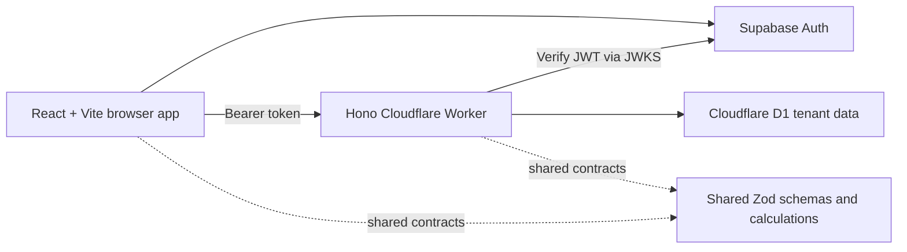
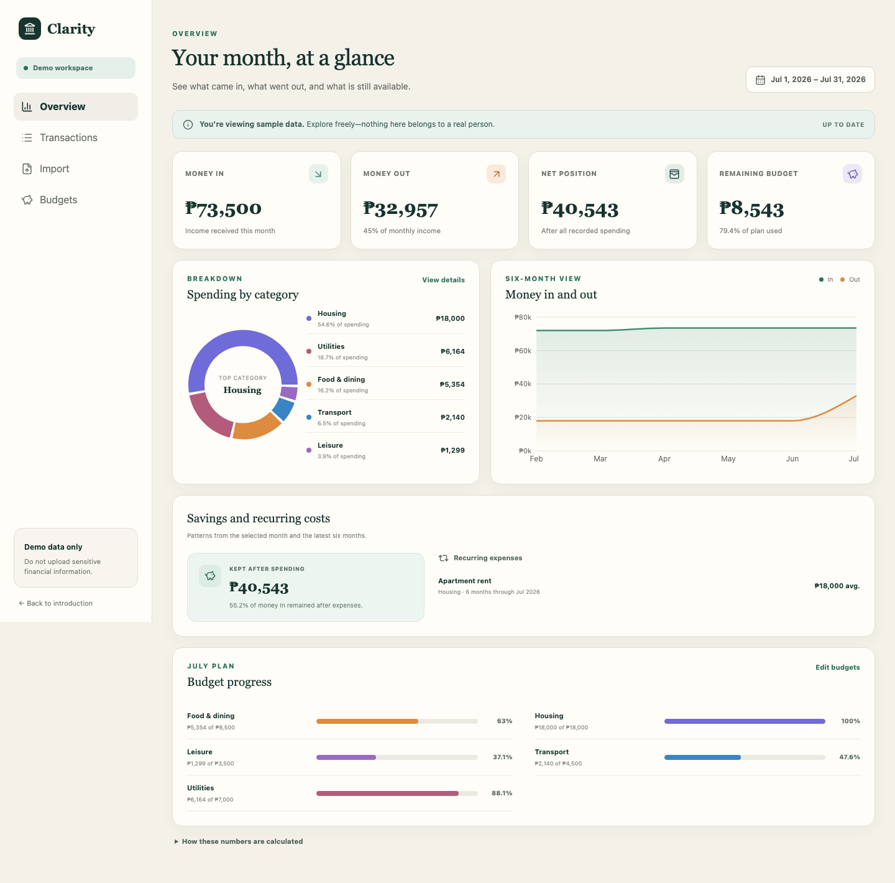
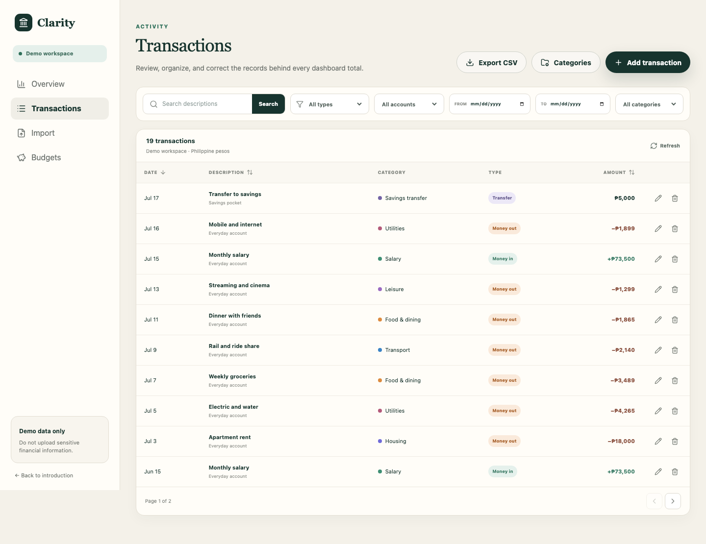
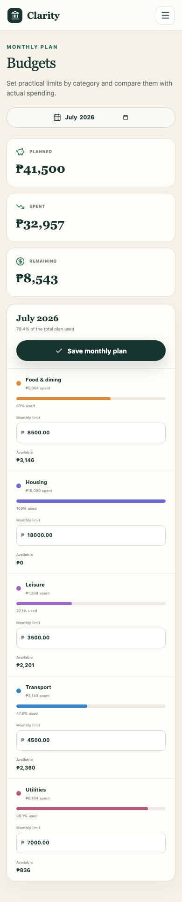

# Clarity — Budget and Expense Analysis

Clarity is a privacy-conscious budgeting web application that turns imported or manually entered transactions into understandable monthly totals, category spending, budget progress, and trends. Supabase Auth provides email/password accounts and sessions, while the Cloudflare Worker stores each user's financial records in an isolated D1 tenant. A public read-only demo remains available with realistic fictional data.

## Live demo

- Production: [clarity-budget.pages.dev](https://clarity-budget.pages.dev)
- Preview: [clarity-budget-preview.pages.dev](https://clarity-budget-preview.pages.dev)
- Source: [github.com/dondon3109/budget-and-expense-analysis-tool](https://github.com/dondon3109/budget-and-expense-analysis-tool)

The application uses Cloudflare Pages, Workers, and D1 together with Supabase Auth. The public demo contains fictional data; authenticated workspaces are private and tenant-scoped.

## Current state

The current implementation includes:

- Responsive landing page and demo dashboard.
- Savings-rate and recurring-expense insights derived from the latest six months.
- Hono API running on Cloudflare Workers with a D1 binding.
- Tenant-scoped Drizzle schema and repeatable local migrations/seed data.
- Shared TypeScript rules for money normalization, import fingerprints, dashboard totals, transfers, empty states, and over-budget behavior.
- Accessible text equivalents for chart data and keyboard-visible focus states.
- Lazy-loaded routes so the landing page does not download the charting bundle.
- Passing unit, API, component, desktop/mobile browser, lint, typecheck, production-build, and Lighthouse gates.
- Supabase email/password sign-up, confirmation, login, password recovery, session refresh, and sign-out.
- Worker-side Supabase JWT verification and fail-closed private API routes.
- Automatic D1 tenant bootstrap with starter accounts/categories and strict per-user query scope.
- D1-backed authenticated write/import throttling keyed by resolved tenant.

Authenticated transaction management, CSV preview/commit, editable budgets, and filtered export are implemented. The public demo exposes only the dashboard; all financial writes and exports require a verified Supabase session. See [the implementation roadmap](docs/implementation-roadmap.md), [deployment runbook](docs/deployment.md), and [CSV import guide](docs/csv-import.md).

## Architecture



The app stores currency as integer centavos, uses ISO dates at the API boundary, excludes transfers from income/expense totals, and scopes every data record to an explicit tenant. The public dashboard uses the `demo` tenant. Each verified Supabase user is mapped to a distinct D1 tenant, created with starter categories and an account on first access.

More detail: [architecture notes](docs/architecture.md).

## Screenshots



| Transactions and account filters                                            | Mobile budget editor                                                 |
| --------------------------------------------------------------------------- | -------------------------------------------------------------------- |
|  |  |

Regenerate all five portfolio images from a running local app with `pnpm capture:screenshots`.

## Local setup

Requirements: Node.js 24+ and pnpm 11.

1. In Supabase Auth URL configuration, add `http://localhost:5173/auth/callback` as an allowed redirect URL.
2. Create `apps/web/.env.local` with the browser values from `.env.example`.
3. Set the matching `SUPABASE_URL` in `apps/api/wrangler.jsonc` (or an ignored local Wrangler configuration).
4. Run:

```bash
pnpm install --frozen-lockfile
pnpm db:migrate:local
pnpm db:seed:local
pnpm dev
```

Open `http://localhost:5173`. The Worker API runs at `http://localhost:8787`. Only the Supabase publishable key belongs in browser configuration; never expose a secret or service-role key.

## Quality checks

```bash
pnpm lint
pnpm typecheck
pnpm test
pnpm test:e2e
pnpm build
pnpm lighthouse
```

## Repository map

```text
apps/web/          React/Vite frontend
apps/api/          Hono Cloudflare Worker
packages/shared/   Shared schemas, calculations, and domain types
db/                Drizzle schema, migrations, and demo seed
docs/              Architecture and delivery roadmap
e2e/               Desktop/mobile browser journeys and clean teardown
scripts/           Non-mutating production smoke verification
```

## Privacy and scope

The public demo is read-only and contains fictional data. Authenticated financial records are stored in the user's isolated D1 tenant after the Worker verifies their Supabase token. Clarity does not connect to banks and does not provide financial, tax, investment, or legal advice.

The original product plan is preserved in [budget-expense-analysis-tool.pdf](budget-expense-analysis-tool.pdf). Engineering evidence is summarized in the [test strategy](docs/test-strategy.md), [performance report](docs/performance.md), and [case study](docs/case-study.md).
