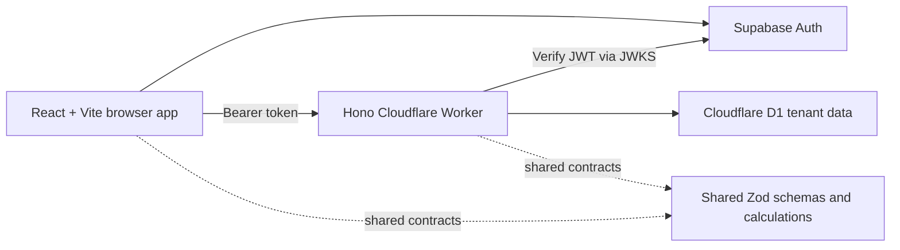

# Zoption — Budget and Expense Analysis

Zoption is a privacy-conscious budgeting web application that turns imported or manually entered transactions into understandable monthly totals, category spending, budget progress, and trends. Supabase Auth provides email/password accounts and sessions, while a Cloudflare Worker stores each user's financial records in an isolated D1 tenant.

## Hosted app

- Production: [clarity-budget.pages.dev](https://clarity-budget.pages.dev)
- Preview: [clarity-budget-preview.pages.dev](https://clarity-budget-preview.pages.dev)
- Source: [github.com/dondon3109/budget-and-expense-analysis-tool](https://github.com/dondon3109/budget-and-expense-analysis-tool)

The public site is a marketing and authentication surface with a static illustrative dashboard preview. Real financial data is available only after authentication and is never seeded into a new workspace.

## Current state

The implementation includes:

- Responsive landing, signup, login, recovery, and private application routes with a persistent light/dark appearance switch.
- Supabase email/password signup, confirmation, login, session refresh, password recovery, and sign-out.
- Worker-side Supabase JWT verification and fail-closed `/api/app/*` routes.
- Automatic D1 tenant bootstrap with an Everyday account and starter categories.
- Empty first-use onboarding; transactions and budgets begin blank.
- Transaction CRUD, category management, filters, pagination, and CSV export.
- Preview-first CSV/XLS/XLSX selection or drag-and-drop import with header detection, BPI/BDO/MariBank/Bank of America/JPMorgan presets, signed or Debit/Credit amounts, U.S. slash dates, bulk categorization, duplicate prevention, and atomic commit.
- Editable monthly budgets, category spending, six-month trends, savings rate, and recurring-expense insights.
- Tenant-scoped rate limiting for authenticated writes and imports.
- Accessible chart tables, keyboard-visible focus states, mobile layouts, and route-level code splitting.

## Architecture



The app stores Philippine pesos as integer centavos, uses ISO dates at the API boundary, excludes transfers from income/expense totals, and scopes every financial record to the tenant resolved from the verified Supabase user. See [architecture notes](docs/architecture.md).

## Screenshot capture

With the local app running, `pnpm capture:screenshots` captures repeatable landing, login, and signup views under `docs/screenshots/`. Financial workspace screenshots require an authenticated test account and are intentionally not generated from shared seeded records.

## Local setup

Requirements: Node.js 24+ and pnpm 11.

1. In Supabase Auth URL configuration, add `http://localhost:5173/auth/callback` as an allowed redirect URL.
2. Create `apps/web/.env.local` with the browser values from `.env.example`.
3. Set the matching `SUPABASE_URL` in `apps/api/wrangler.jsonc` or an ignored local Wrangler configuration.
4. Run:

```bash
pnpm install --frozen-lockfile
pnpm db:migrate:local
pnpm dev
```

Open `http://localhost:5173`. The Worker API runs at `http://localhost:8787`. Only the Supabase publishable key belongs in browser configuration; never expose a secret or service-role key.

## Quality checks

```bash
pnpm lint
pnpm typecheck
pnpm test
pnpm test:e2e
pnpm build
pnpm lighthouse
```

## Repository map

```text
apps/web/          React/Vite frontend and authenticated UI
apps/api/          Hono Cloudflare Worker and tenant-scoped API
packages/shared/   Shared schemas, calculations, CSV, and domain types
db/                Drizzle schema and forward-only migrations
docs/              Architecture, testing, deployment, and product evidence
e2e/               Desktop/mobile public and authentication journeys
scripts/           Non-mutating smoke checks and screenshot capture
```

## Privacy and scope

Authenticated financial records are stored in the user's isolated D1 tenant after the Worker verifies their Supabase token. New workspaces contain an account and starter categories but no transactions or budgets. Zoption does not connect to banks and does not provide financial, tax, investment, or legal advice.

Engineering evidence is summarized in the [test strategy](docs/test-strategy.md), [performance report](docs/performance.md), [deployment runbook](docs/deployment.md), and [case study](docs/case-study.md).
