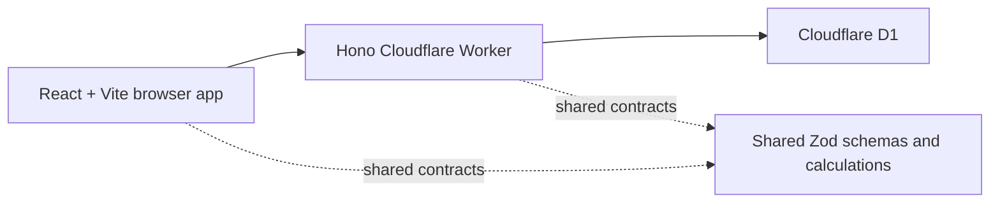

# Clarity — Budget and Expense Analysis

Clarity is a privacy-conscious budgeting web application that turns imported or manually entered transactions into understandable monthly totals, category spending, budget progress, and trends. The first release is a public demo with realistic fictional data; authentication and private multi-device persistence are deliberately deferred until the core workflow is stable.

## Live demo

- Production: [clarity-budget.pages.dev](https://clarity-budget.pages.dev)
- Preview: [clarity-budget-preview.pages.dev](https://clarity-budget-preview.pages.dev)
- Source: [github.com/dondon3109/budget-and-expense-analysis-tool](https://github.com/dondon3109/budget-and-expense-analysis-tool)

The release uses Cloudflare Pages, Workers, and D1 without paid add-ons. Both environments contain fictional demo data only.

## Current state

The complete demo workflow is deployed and working:

- Responsive landing page and demo dashboard.
- Savings-rate and recurring-expense insights derived from the latest six months.
- Hono API running on Cloudflare Workers with a D1 binding.
- Tenant-scoped Drizzle schema and repeatable local migrations/seed data.
- Shared TypeScript rules for money normalization, import fingerprints, dashboard totals, transfers, empty states, and over-budget behavior.
- Accessible text equivalents for chart data and keyboard-visible focus states.
- Lazy-loaded routes so the landing page does not download the charting bundle.
- Passing unit, API, component, desktop/mobile browser, lint, typecheck, production-build, and Lighthouse gates.
- D1-backed write/import throttling that stores only hashed client identifiers.

Transaction management, CSV preview/commit, editable budgets, filtered export, and clean-teardown browser journeys are implemented. Separate preview and production Cloudflare resources are migrated, seeded with fictional data, deployed, and smoke-tested. See [the implementation roadmap](docs/implementation-roadmap.md), [deployment runbook](docs/deployment.md), and [CSV import guide](docs/csv-import.md).

## Architecture



The app stores currency as integer centavos, uses ISO dates at the API boundary, excludes transfers from income/expense totals, and scopes every data record to an explicit tenant. The public demo uses the `demo` tenant; future authenticated users will receive separate tenants without changing the financial rules.

More detail: [architecture notes](docs/architecture.md).

## Screenshots


| Transactions and account filters                                            | Mobile budget editor                                                 |
| --------------------------------------------------------------------------- | -------------------------------------------------------------------- |
|  |  |

Regenerate all five portfolio images from a running local app with `pnpm capture:screenshots`.

## Local setup

Requirements: Node.js 24+ and pnpm 11.

```bash
pnpm install --frozen-lockfile
pnpm db:migrate:local
pnpm db:seed:local
pnpm dev
```

Open `http://localhost:5173`. The Worker API runs at `http://localhost:8787`.

## Quality checks

```bash
pnpm lint
pnpm typecheck
pnpm test
pnpm test:e2e
pnpm build
pnpm lighthouse
```

## Repository map

```text
apps/web/          React/Vite frontend
apps/api/          Hono Cloudflare Worker
packages/shared/   Shared schemas, calculations, and domain types
db/                Drizzle schema, migrations, and demo seed
docs/              Architecture and delivery roadmap
e2e/               Desktop/mobile browser journeys and clean teardown
scripts/           Non-mutating production smoke verification
```

## Privacy and scope

Demo data only; do not upload sensitive financial information. This application does not connect to banks and does not provide financial, tax, investment, or legal advice.

The original product plan is preserved in [budget-expense-analysis-tool.pdf](budget-expense-analysis-tool.pdf). Engineering evidence is summarized in the [test strategy](docs/test-strategy.md), [performance report](docs/performance.md), and [case study](docs/case-study.md).
