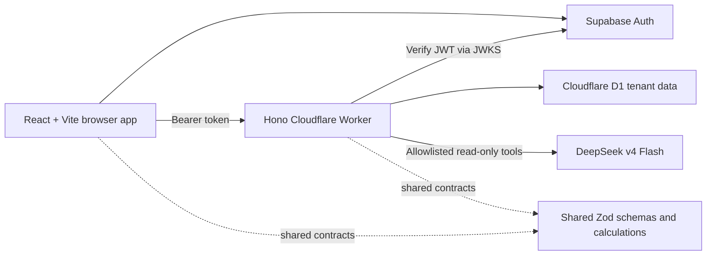

# Zoption — Budget and Expense Analysis

Zoption is a privacy-conscious budgeting web application that turns imported or manually entered transactions into understandable monthly totals, category spending, budget progress, and trends. Supabase Auth provides email/password accounts and sessions, while a Cloudflare Worker stores each user's financial records in an isolated D1 tenant.

## Hosted app

- Frontend: [zoption.site](https://zoption.site)
- API: [api.zoption.site](https://api.zoption.site)
- Source: [github.com/dondon3109/budget-and-expense-analysis-tool](https://github.com/dondon3109/budget-and-expense-analysis-tool)

The public site is a marketing and authentication surface with a static illustrative dashboard preview. Real financial data is available only after authentication and is never seeded into a new workspace.

## Current state

The implementation includes:

- Responsive landing, signup, login, recovery, public legal, and private application routes with persistent Light, Dark, and Coffee themes.
- Supabase email/password signup, confirmation, login, session refresh, password recovery, and sign-out.
- Worker-side Supabase JWT verification and fail-closed `/api/app/*` routes.
- Automatic D1 tenant bootstrap with an Everyday account and starter categories.
- High-friction, permanent account deletion from Account Settings: server-side password reauthentication, D1 workspace purge, owned-avatar cleanup, Auth hard deletion, and a durable tombstone that prevents stale tokens from recreating a workspace.
- Empty first-use onboarding; transactions and budgets begin blank.
- Transaction CRUD, category management, filters, pagination, and CSV export.
- Preview-first CSV/XLS/XLSX selection or drag-and-drop import with header detection, BPI/BDO/MariBank/Bank of America/JPMorgan presets, signed or Debit/Credit amounts, U.S. slash dates, bulk categorization, duplicate prevention, and atomic commit.
- Editable monthly budgets, category spending, six-month trends, savings rate, and recurring-expense insights.
- Account balances calculated from recorded transaction ledgers, with explicit disclosure that they are not live bank balances and have no opening-balance snapshot.
- A Goals & debt planning ledger with tenant-owned savings goals, debt inputs, deterministic target-date contributions, and avalanche/snowball projections.
- A tenant-scoped, read-only AI Financial Assistant using DeepSeek v4 Flash, deterministic compliance/date policy, required backend tools, grounded-answer validation, versioned provider consent, response provenance, and 90-day chat plus sanitized-audit retention.
- Tenant-scoped rate limiting for authenticated writes, imports, and assistant generation.
- Accessible chart tables, keyboard-visible focus states, mobile layouts, and route-level code splitting.
- Public Terms of Service, Privacy Policy, and Cookie Policy routes plus a shared legal footer.
- Versioned, fail-closed browser consent with Necessary always on, optional Analytics/Marketing off by default, cross-tab synchronization, and no current analytics or marketing vendor.

## Architecture


```mermaid
flowchart LR
  Browser["React + Vite browser app"] --> Supabase["Supabase Auth"]
  Browser -->|Bearer token| Worker["Hono Cloudflare Worker"]
  Worker -->|Verify JWT via JWKS| Supabase
  Worker --> D1["Cloudflare D1 tenant data"]
  Worker -->|Allowlisted read-only tools| DeepSeek["DeepSeek v4 Flash"]
  Browser -. shared contracts .-> Shared["Shared Zod schemas and calculations"]
  Worker -. shared contracts .-> Shared
```

The app stores Philippine pesos as integer centavos, uses ISO dates at the API boundary, excludes transfers from income/expense totals, and scopes every financial record to the tenant resolved from the verified Supabase user. See [architecture notes](docs/architecture.md).

## Screenshot capture

With the local app running, `pnpm capture:screenshots` captures repeatable landing, login, and signup views under `docs/screenshots/`. Financial workspace screenshots require an authenticated test account and are intentionally not generated from shared seeded records.

## Local setup

Requirements: Node.js 24+ and pnpm 11.

1. In Supabase Auth URL configuration, add `http://localhost:5173/auth/callback` as an allowed redirect URL.
2. Apply the tracked Supabase migrations to the project used for local development:

   ```bash
   pnpm dlx supabase login
   pnpm dlx supabase link --project-ref YOUR_PROJECT_REF
   pnpm dlx supabase db push --linked
   ```

   This creates the public `avatars` bucket. Avatar files can be read by anyone with their URL, while Storage policies restrict uploads and deletes to each authenticated user's own folder.

3. Create `apps/web/.env.local` with the browser values from `.env.example`.
4. Set the matching `SUPABASE_URL` in `apps/api/wrangler.jsonc` or an ignored local Wrangler configuration.
5. To use the assistant locally, add `DEEPSEEK_API_KEY=...` to ignored `apps/api/.dev.vars`. Never place it in a `VITE_*` variable.
6. Run:

```bash
pnpm install --frozen-lockfile
pnpm db:migrate:local
pnpm dev
```

Open `http://localhost:5173`. The Worker API runs at `http://localhost:8787`. Only the Supabase publishable key belongs in browser configuration; never expose a secret or service-role key.

## Quality checks

```bash
pnpm lint
pnpm typecheck
pnpm test
pnpm test:e2e
pnpm build
pnpm lighthouse
```

## Repository map

```text
apps/web/          React/Vite frontend and authenticated UI
apps/api/          Hono Cloudflare Worker and tenant-scoped API
packages/shared/   Shared schemas, calculations, CSV, and domain types
db/                Drizzle schema and forward-only migrations
docs/              Architecture, testing, deployment, and product evidence
e2e/               Desktop/mobile public and authentication journeys
scripts/           Non-mutating smoke checks and screenshot capture
```

## Privacy and scope

Authenticated financial records, user-managed goals/debts, assistant history, and sanitized assistant audit snapshots are stored in the user's isolated D1 tenant after the Worker verifies their Supabase token. New workspaces contain an account and starter categories but no transactions, budgets, goals, or debts. Assistant questions require current versioned DeepSeek data-sharing consent, use allowlisted read-only tools, and expire with their sanitized audit snapshots after the thread's 90-day retention window. Browser tracking consent is separate: no Analytics or Marketing provider is currently enabled, and future optional integrations must remain blocked until their category is explicitly granted. Zoption does not connect to banks and does not provide personalized financial, tax, investment, legal, retirement-allocation, or insurance advice. Remaining provider-retention and legal-policy claims require business/legal confirmation before publication. See [AI Financial Assistant](docs/assistant.md).

Engineering evidence is summarized in the [test strategy](docs/test-strategy.md), [performance report](docs/performance.md), [deployment runbook](docs/deployment.md), and [case study](docs/case-study.md).
