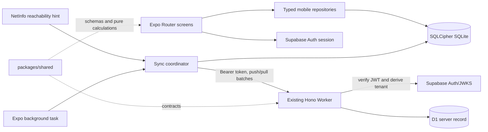

# Native mobile architecture

## Verified baseline

The repository is a pnpm monorepo with React/Vite in `apps/web`, a Hono Cloudflare Worker in `apps/api`, tenant-isolated financial data in D1, Supabase Auth for identity/session management, profile pictures in Cloudflare R2, reusable TypeScript in `packages/shared`, and the native mobile client in `apps/mobile`.

The native application is the supported Android and iOS mobile client under `apps/mobile`. The website remains the browser client, and both clients use the same authenticated Worker boundary and tenant-scoped data model.

## Ownership boundaries

| Concern                                                                    | Owner                                                               |
| -------------------------------------------------------------------------- | ------------------------------------------------------------------- |
| Identity, access/refresh tokens, OAuth, password recovery                  | Supabase Auth, persisted through a SecureStore-backed adapter       |
| Authorization, tenant derivation, ownership, plan enforcement, rate limits | Worker                                                              |
| Server financial record and cross-device ordering                          | D1 through Worker repositories                                      |
| On-device financial rendering and durable offline work                     | User-scoped SQLCipher database                                      |
| Temporary presentation and workflow composition                            | Small Zustand stores                                                |
| Connectivity indication                                                    | NetInfo hint plus actual Worker result                              |
| Themes and reusable mobile components                                      | Mobile design tokens/primitives; NativeWind is only a utility layer |

## Mobile modules

- `app/`: Expo Router public and authenticated groups, stacks, tabs, callbacks, and platform-specific routes.
- `src/auth/`: Supabase client, SecureStore session adapter, lifecycle refresh, identity transition coordinator.
- `src/db/`: SQLCipher open/key lifecycle, migrations, repositories, observable query invalidation, recovery states.
- `src/sync/`: outbox, push/pull transport, retry classifier, cursor application, conflict materialization, background entrypoint.
- `src/api/`: bearer-aware Worker client, Zod decoding, typed error normalization, no arbitrary URL surface.
- `src/domain/`: React Native-safe shared exports and mobile-only orchestration types.
- `src/features/`: vertical feature modules that depend on repositories rather than holding financial records in component state stores.
- `src/stores/`: small UI-only Zustand stores with selectors and validated/versioned allowlisted persistence.
- `src/ui/`: tokens, themes, primitives, financial formatting, accessibility helpers, and product components.
- `src/config/`: runtime-validated public configuration and app-variant metadata.

## Application variants

| Variant     | Android package                | Proposed iOS bundle ID     | Purpose                                                    |
| ----------- | ------------------------------ | -------------------------- | ---------------------------------------------------------- |
| Development | `site.zoption.android.dev`     | `site.zoption.ios.dev`     | Local development build with developer tooling             |
| Preview     | `site.zoption.android.preview` | `site.zoption.ios.preview` | Internal distribution against non-production configuration |
| Production  | `site.zoption.android`         | `site.zoption.ios`         | Website-linked Zoption Beta build; no app-store listing    |

The final iOS bundle identifier is a proposal only. Variant selection must be build-profile controlled and validated at config load.

## Navigation shape

- Root stack owns startup, public auth flow, callbacks, recovery, and authenticated shell.
- Authenticated tabs prioritize Home, Transactions, Budgets, and Plan; less-frequent surfaces live under a native More/settings stack.
- iOS and Android may use platform-specific toolbar, sheet, back, and tab behavior while sharing feature components.
- Route guards redirect for interface coherence only. Every Worker request still authenticates and authorizes independently.

## Data access rules

- Financial screens query SQLite first and subscribe to repository invalidation.
- Change subscriptions go through `subscribeToLocalChanges`, which keeps one native
  `onDatabaseChange` listener per open database and coalesces each subscriber's refresh. A
  pull page writes many rows in one transaction, so a listener per hook would re-run every
  mounted query once per applied row.
- `useDashboardData(anchorDate)` bounds its ledger read to `cashflowWindowStart(anchorDate)`,
  the widest cashflow view, and reads the three newest transactions separately. The caller
  passes the same local date to `buildDashboardView`, so the chart can never read a window the
  query did not load. Account balances still aggregate the whole ledger in SQL.
- A mutation validates, writes the local record and outbox transaction atomically, then updates the UI.
- Sync acknowledgement changes local sync metadata; NetInfo never marks work synchronized.
- API payloads and persisted rows are decoded with Zod before use.
- Tokens, tenant identity, financial entities, outbox rows, and plan entitlement never enter Zustand or AsyncStorage.
- Identity change closes the old database, clears in-memory repositories/query observers, and opens a subject-derived workspace only after the key is resolved.
- A restored Supabase session opens only the immutable-subject-scoped encrypted workspace, allowing
  cached financial screens to render offline. The independent `/api/app/me` assertion must confirm the
  Worker-derived user and tenant before synchronization starts. An identity mismatch signs out the
  session while preserving the encrypted workspace for deliberate recovery.
- Startup migrations use the keyed connection's regular transaction. Expo's exclusive transaction helper creates another native connection and therefore cannot be used unless that connection is separately keyed.
- D1 owns cross-device ordering through tenant-scoped integer sequences. Database triggers attach
  existing web/API writes to immutable mobile change rows, while the authenticated pull route exposes
  only the middleware-derived tenant. The mobile cursor is progress metadata, never authorization.
- Pull application and cursor advancement share one keyed local transaction. Financial observers are
  invalidated only after commit, so the interface cannot render or label a partial page as synchronized.
- Local financial mutation, outbox state transitions, push acknowledgement, and pull application share
  one serialized writer around that keyed connection. The UI renders only after the durable local
  transaction completes; an in-flight idempotency payload cannot be edited into a different request.

## Cold start

- `app/_layout.tsx` holds the native splash from module scope and releases it once the stored
  session resolves, so the route that session selects is the first thing painted. A timeout
  releases it anyway, and the root error boundary releases it too.
- `ZoptionThemeProvider` hydrates the stored theme preference before rendering children. It
  renders nothing until hydration settles, which is also what happens when the stored value
  cannot be read and the store keeps its default.
- The MaterialCommunityIcons font is loaded at module scope. `@expo/vector-icons` paints an
  empty glyph until its font resolves, so starting earlier is what keeps the first frame from
  popping icons in afterwards.
- `metro.config.cjs` enables `inlineRequires`, so a cold start evaluates only the modules the
  first screen touches. Side-effect imports stay eager because they have no binding to inline.
- `src/diagnostics/startup-timing.ts` records dev-only phase marks. It is gated on `__DEV__`,
  never ships, and stays out of the sanitized telemetry pipeline.

## Development-build requirement

SQLCipher, native authentication capabilities, background tasks, and release-representative behavior require Expo development builds. Expo Go may be useful for no proof claimed here and is not part of the production validation path.

## Compatibility decision

- Expo SDK 57 is the current stable SDK line and targets React Native 0.86/React 19.2.
- NativeWind 4.2.6 is the stable production line. NativeWind 5 remains preview and is excluded.
- React Native New Architecture is mandatory in React Native 0.86. Expo SDK 57 no longer accepts the legacy `newArchEnabled` toggle, so there is no opt-out configuration to carry.
- Package versions are exact-pinned in `apps/mobile/package.json`; the workspace lockfile is the reproducibility authority.
